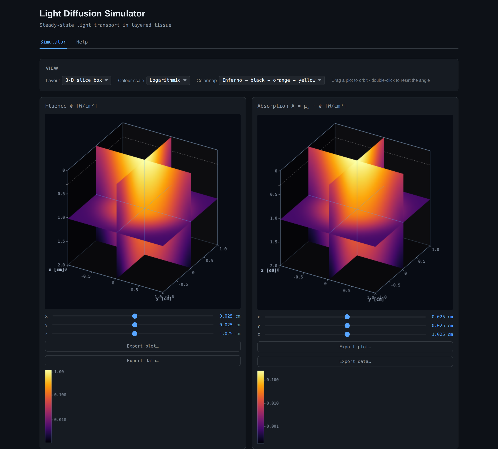

# Fluxel2



A Tauri desktop app (TypeScript frontend + Rust backend) for simulating light transport in biological tissue,
targeting Linux and Windows — a schema-driven parameter UI, a 3-slice volume renderer (see Visualisation
below), and four models: a Monte Carlo reference plus three closed-form approximations (see Models below).
See [AGENTS.md](AGENTS.md) for the current layout.

It started as a port of [Fluxel](https://github.com/TZ387/Fluxel), a static, build-free HTML/CSS/vanilla-JS
browser simulator covering the diffusion-approximation part of this ground, but has since grown well beyond
it: the Monte Carlo model, Liemert & Kienle 2010, and the beam-shaping features described below have no Fluxel
counterpart.

## Install

Go to [**Releases**](https://github.com/TZ387/Fluxel2/releases/latest) and download the file for your system.
Nothing else is needed — Rust, Node and the build tools below are only for building from source.

| System | Download | Then |
| --- | --- | --- |
| Linux | `fluxel2_<version>_amd64.AppImage` | `chmod +x fluxel2_*.AppImage` and run it. No install, no root, portable. |
| Linux | `fluxel2_<version>_amd64.deb` | `sudo apt install ./fluxel2_*.deb` |
| Windows | `fluxel2_<version>_x64-setup.exe` | Run it. Installs for the current user, no admin needed. |
| Windows | `fluxel2_<version>_x64_en-US.msi` | Run it. Installs for all users, needs admin. |

Either Linux download works on any x86-64 distribution recent enough to have GTK 3 and WebKitGTK 4.1 (Ubuntu
22.04 and later, and equivalents); the AppImage is the one to reach for if you're not on Debian/Ubuntu or don't
want to install anything. `sudo apt install` is preferred over `dpkg -i` for the `.deb` because it pulls in
missing dependencies rather than just reporting them.

Both Windows installers run on Windows 10 version 1803 (May 2018) or later and on Windows 11 — that's what
Tauri's WebView2 dependency requires, and WebView2 has shipped with Windows itself since 1803, so there's
normally nothing extra to install. On an older or never-updated Windows 10 that lacks it, the installer offers
to fetch it.

The three worked examples are installed alongside the app, and the **Load settings…** dialog opens in that
folder the first time you use it, so there is nothing to hunt for. See [Settings files](#settings-files).

## Build from source

Needs [Rust](https://rustup.rs) and [Node.js](https://nodejs.org) (LTS) on every platform, plus one set of
platform prerequisites.

On **Linux**, the system libraries Tauri builds against:

```bash
sudo apt update
sudo apt install libwebkit2gtk-4.1-dev build-essential curl wget file libxdo-dev libssl-dev \
  libayatana-appindicator3-dev librsvg2-dev
```

On **Windows**, the MSVC toolchain: the Microsoft C++ Build Tools with the "Desktop development with C++"
workload, then `rustup default stable-msvc`.

Then, on either:

```bash
git clone https://github.com/TZ387/Fluxel2.git
cd Fluxel2
npm install
npm run tauri build      # installers land in src-tauri/target/release/bundle/
```

Or `npm run tauri dev` to run it without packaging, and `npm test` for the frontend tests.

## Models

Each model is self-contained in Rust under `src-tauri/src/physics/` — its compute, validity checks, and doc
comments with the full derivation notes are the single source of truth (see that directory, not here, for the
math).

- **2-D Monte Carlo (radial symmetry)** — N-layer photon transport; the default, and the reference the other three
  are checked against. Traces photon packets through the layer stack (hop by an exponentially sampled free path,
  deposit weight at each collision, scatter by Henyey-Greenstein, Fresnel reflect/refract at every refractive-index
  step including total internal reflection) rather than approximating the transport equation, so none of the
  restrictions the other models carry apply: a layer thinner than a mean free path, absorption comparable to
  scattering, an index mismatch between layers, or the unscattered first millimetre below the surface are all
  handled as ordinary cases. Written from the published MCML algorithm (Wang, Jacques & Zheng 1995), not
  ported from existing code, so it carries no third-party license obligations.

  Every geometry it accepts is axisymmetric — flat layers, normal incidence, a radially symmetric beam — so it
  scores photons into an (r, z) grid rather than 3-D voxels, which is exactly the axisymmetric kernel the two
  point-source diffusion models already feed to `beam.rs`. Its parameters are that grid: Δr is one radial
  ring's width, N<sub>r</sub> how many rings (so the run reaches R = N<sub>r</sub>·Δr from the axis), and
  N<sub>z</sub> divides the stack's depth — no L<sub>x</sub>/L<sub>y</sub> and no N<sub>x</sub>/N<sub>y</sub>,
  since the simulation has no x and no y to divide up. What gets drawn is still a box, because that is what
  the viewers draw: a square of half-width R at one voxel per ring, so the picture is at the resolution that
  was computed. One run therefore serves any beam pattern (see
  below), and the beam *profile* costs nothing either: each packet's launch point is drawn from the profile
  instead of the kernel being convolved with it afterwards. That is what makes an in-house Monte Carlo
  affordable here — a full 3-D voxel simulation would need orders of magnitude more photons for the same
  noise. The price is that the answer is statistical: the photon budget is a parameter, error falls as
  1/√photons, and the run reports its own per-voxel standard error as an overlay (batch means over 64 equal
  batches).

  Those batches are also the unit of parallel work, so a run spreads over every core the machine has
  (`std::thread::scope`, no dependency). A batch seeds its own generator from its own index and fills its own
  tally, so nothing writable is shared: no locks, no atomic accumulation, and the answer doesn't depend on how
  many cores ran it — there is a test pinning that down. Measured 4.2x on a 4-core/8-thread laptop, where
  all-core turbo is well below single-core turbo; a desktop should land closer to its thread count.
  `src-tauri/src/physics/monte_carlo.rs`.
- **Farrell, Patterson & Wilson (1992)** — pencil beam, semi-infinite slab. A narrow collimated beam entering a
  homogeneous tissue slab, modelled as a real + image point-source pair below the surface (accounting for the
  refractive-index mismatch at the air-tissue boundary). Has genuine 3-D structure: fluence falls off radially
  from where the beam enters. `src-tauri/src/physics/fpw1992.rs`.
- **Kubelka-Munk** — two-flux, N-layer stack. A 1-D model: the sample is illuminated by a perfectly diffuse flux
  across the whole top face, and two counter-propagating streams (up/down) are tracked through an arbitrary
  stack of homogeneous layers, each with its own absorption, scattering, and thickness. No lateral structure —
  the computed depth profile is broadcast across every (x, y) column. `src-tauri/src/physics/kubelka_munk.rs`.
- **Liemert & Kienle (2010)** — N-layer, point-source diffusion. The combination FPW1992 and Kubelka-Munk
  each stop short of: a point/pencil beam through a stack of homogeneous layers (1 to 8 of them), solved via a
  Fourier-Bessel series (zeros of J0) on a finite cylinder rather than FPW1992's closed-form shortcut, since
  layering breaks the symmetry that shortcut relies on. Each series term reduces to a 1-D problem in depth
  that any number of layers folds into, via a bottom-up reflection-coefficient recursion — the reference
  implementation this was ported from covers only the top and bottom layer, so that recursion (and with it the
  middle-layer Green's function) is derived here, and checked both against the ported two-layer form and
  against a direct numerical solve. Not in upstream Fluxel — added here to fill the gap its own roadmap named.
  `src-tauri/src/physics/liemert_kienle.rs`.

Both diffusion point-source models (FPW1992 and Liemert & Kienle) also support widening their beam from an idealised
pencil to a Gaussian or flat-top (disk) profile — the finite-beam convolution shared between them lives in
`src-tauri/src/physics/beam.rs`. Liemert-Kienle folds the beam's profile into its existing Fourier-Bessel series
as a per-mode spectral factor (cheap, exact to the model's own cylinder-radius approximation); FPW1992 has no
such series, so its convolution is a direct 2-D numerical integral over the beam footprint instead.

All three point-source models (Monte Carlo included) also take a beam *pattern* — a single spot, a cross (two
scanned rows of pulses at right angles), or a square grid (a fractional handpiece's array) — sharing P0
equally between the spots and superposing their fields, which transport being linear makes exact. The per-spot
field is the same function at every spot, just shifted, so it is evaluated once and reused: a 25-spot grid
costs under twice a single spot, not 25 times.

Every one of those models builds a pattern out of a single radially symmetric per-spot field, which is why the
scan is a cross rather than a bare line — a cross at least looks the same after a quarter turn. Any pattern of
more than one spot is still not radially symmetric, and the Monte Carlo model says so in its validity
warnings: the sum is exact all the same, but the one kernel now has to reach across the whole pattern on the
same photon budget, and its noise overlay adds the spots' errors as if they were independent when they all
come off that single kernel, so it reads a little optimistic where spots overlap.

## Visualisation

Fluence and absorption are shown side by side, each as three orthogonal cuts through the volume, in either of
two layouts. The default is a **3-D slice box**: the cuts drawn where they actually are inside the tissue, at
true proportions, in a box with cm ticks on its outer edges and the layer interfaces marked on the back walls
— so a 0.3 cm epidermis over a 1.7 cm dermis is drawn as the thin layer it is. Drag either plot to orbit it
and both follow, since the point of the pairing is to read one against the other. The alternative **flat
slices** layout puts the three cuts side by side with their own axes: nothing is foreshortened there, so a
distance on screen is a distance in the tissue, which is the view to read a depth off. The colour scale is
logarithmic by default and switchable to linear, the colormap is inferno by default with the original
blue→red ramp still available, and the slice sliders step one voxel at a time but read out in cm. Hovering
either plot reads out the position and the value under the cursor — in the 3-D box that means the nearest cut
at that point, i.e. the surface actually visible — and blue crosshairs mark where the other two cuts pass
through each plane, so the three views read as one volume rather than three pictures.

The 3-D box is plain canvas 2-D, no WebGL and no dependency, which is possible because an orthographic
projection is linear: an axis-aligned slice rectangle projects to a parallelogram, and the map from image
pixels to that parallelogram is exactly the affine transform canvas 2-D already applies to an image. The
occlusion that a depth buffer would otherwise handle — three full planes intersect, so no fixed draw order
works — comes from splitting each plane into quadrants at the other two and drawing the twelve pieces in the
order the three planes' BSP defines. `src/render3d.ts`'s header comment has the reasoning, including why the
obvious centroid-depth shortcut is wrong.

## Settings files

A run's inputs can be saved to a JSON file and loaded back — the parameters, the name given to each layer,
and the view controls the two plots share (layout, colour scale, colormap, camera angle). The format is
deliberately not a new one: the `params` block is verbatim the object the frontend hands to Rust, so a saved
file is literally what was computed, there is nothing to keep in step with the four models' parameter
schemas, and the file is readable, diffable and editable by hand.

```json
{
  "app": "fluxel2-settings",
  "format": 1,
  "model": "monteCarlo",
  "params": {
    "layers": [{ "name": "Epidermis", "mua": 0.1, "mus": 100, "g": 0.9, "n": 1.4, "thickness": 0.3 }],
    "p0": 1, "beam_profile": "pencil", "nx": 40
  },
  "view": { "mode": "box3d", "scale": "log", "cmap": "inferno", "camera": { "az": -1.047, "el": 0.524 } }
}
```

Loading is forgiving on purpose, since a file may have been edited by hand or written by a different build:
a parameter that is missing or unusable falls back to the model's default, a layer count outside what the
model allows is clamped, unknown keys are ignored, and a stale `view` block costs only itself. Each such
substitution is reported under the status line, so a file never loads differently from how it reads without
saying so. A value *outside* its slider's range is the one thing kept as written — the panel widens the
slider to fit it, exactly as typing that value in does. What a file does not record is anything belonging to
a result rather than to its inputs: the slice-plane positions are indices into whatever grid the run used,
and the volumes themselves are the Export item below. `src/settings.ts` owns the format and the checking, and
is pure — `tests/settings.test.ts` covers it without a DOM.

Three worked examples ship with the app — a three-layer skin stack at 1064 nm, 1320 nm and 1440 nm — and
**Load settings…** opens in their folder the first time, so they are one click away on a fresh install.
Afterwards the dialog remembers wherever you last picked a file instead. They are also in this repo's
[`examples/`](examples/) folder. Their optical properties come from Salomatina et al., *Optical properties of
normal and cancerous human skin in the visible and near-infrared spectral range*, J. Biomed. Opt. **11**(6)
064026 (2006), Figs. 2–4; that paper reports `mua` and the *reduced* scattering coefficient `mus'`, so each
file stores `mus` = `mus'` / (1 − g) with the g = 0.8 and n = 1.4 that the paper's own inverse Monte Carlo
assumed for every skin layer.

## Export

Each plot has its own **Export plot…** and **Export data…** buttons, under that panel's slice sliders —
per-panel rather than one button for both, since fluence and absorption are independent questions to save.

**Export plot…** writes a PNG of that panel exactly as shown — whichever layout and colour scale are current —
with its colourbar composited alongside it, so the file says what the colour means without the app open next
to it.

**Export data…** writes the underlying voxel grid instead of a picture: a `.npy` array
(`<model>-phi.npy` / `<model>-abs.npy`) plus a `<model>-phi.json` / `<model>-abs.json` sidecar of what a bare
array can't carry — the grid it was evaluated on (`nx`/`ny`/`nz`, `lx`/`ly`/`lz` in cm, the layer interface
depths; for the Monte Carlo model that is the box its N<sub>r</sub> rings of Δr work out to, not parameters
typed in), which field it is and its units, and the model that produced it. `.npy` rather than CSV or plain JSON
for the array itself: the largest grid this app allows is 400³ = 64 million voxels, where a text encoding runs
to hundreds of megabytes and `.npy` is the raw float bytes plus a short header — readable with one call from
either Python or Julia:

```python
import json, numpy as np

phi = np.load("monteCarlo-phi.npy")       # shape (nz, ny, nx)
meta = json.load(open("monteCarlo-phi.json"))

# the x-y plane nearest z = 0.5 cm
z = (np.arange(meta["nz"]) + 0.5) * meta["lz"] / meta["nz"]  # voxel centres
iz = int(np.abs(z - 0.5).argmin())
plane = phi[iz]                           # shape (ny, nx)
```

```julia
using NPZ, JSON

phi = npzread("monteCarlo-phi.npy")       # size (nz, ny, nx), 1-indexed
meta = JSON.parsefile("monteCarlo-phi.json")

# the x-y plane nearest z = 0.5 cm
z = [(i - 0.5) * meta["lz"] / meta["nz"] for i in 1:meta["nz"]]  # voxel centres
iz = argmin(abs.(z .- 0.5))
plane = phi[iz, :, :]                     # size (ny, nx)
```

NPZ.jl corrects for the row-major/column-major difference itself, so `phi[iz, iy, ix]` in Julia (1-indexed) and
`phi[iz-1, iy-1, ix-1]` in NumPy (0-indexed) are the same voxel. x and y run from −lx/2 / −ly/2 to +lx/2 / +ly/2,
centred on the beam axis; z runs from 0 at the surface to lz. Every voxel's coordinate is its *centre*, which
the `+ 0.5` / `i - 0.5` above account for — the same convention the sliders' own cm readout uses
(`axisPosition` in `src/main.ts`). The array's memory order is `(nz, ny, nx)`, z slowest and x fastest
(`src/render.ts`'s `probeAt` uses the same arithmetic the physics writes it with:
`ix + iy*nx + iz*nx*ny`), which is exactly C order for that shape — the metadata's own `"axes": ["z", "y", "x"]`
says so without requiring the source to be read.

## Roadmap

Adapted from [Fluxel's own roadmap](https://github.com/TZ387/Fluxel#roadmap) — a reasonable source of next
tasks if none is otherwise specified:

- **Monte Carlo on the GPU** — `wgpu` + a WGSL compute shader, which reaches Vulkan on Linux and DX12 on
  Windows and so runs on Intel and AMD integrated graphics rather than NVIDIA only, and needs no C++
  toolchain or vendor SDK. The (r, z) tally is small enough to live in a workgroup's shared memory, so a
  workgroup would keep a private tally exactly as a CPU worker does now and only reduce globally at the end —
  the same decomposition, one level down. Two real costs: WGSL is f32-only, so the tally needs fixed-point
  `atomicAdd` on u32 (what MCX does), and it is a genuine port of the inner loop. Worth it on a discrete
  card; on integrated graphics sharing system memory with the CPU it would be a wash at best, since photon
  transport is branch-divergent and tally-heavy — the shape a small iGPU handles worst.

  A cheaper lever first, if runs ever feel slow: tracks average some 500 collisions per photon for typical
  tissue, and a more aggressive roulette threshold trades a little variance for a lot of wall clock.
- **Isosurface overlay** — a true isosurface in the 3-D box: the closed shell where the field equals one
  chosen level, most usefully an absorbed-power density corresponding to a damage threshold, which answers
  "how deep and how wide is the region above it" in one shape. Marching cubes belongs in Rust next to the
  physics, returning a mesh over the same raw-bytes IPC the volumes already use; the rendering is the real
  cost, since a translucent shell intersecting the slice planes is where the canvas-2-D approach above runs
  out and WebGL starts paying for itself. Worth most for the multi-spot patterns, where the question is
  whether adjacent spots' fields merge at depth. Cheaper and most of the value: **iso-contour lines** on the
  slices themselves, which marching squares gives for a fraction of the work and which you can read a number
  off.
- **Model-vs-model difference view** — colour bounds come from each volume separately, so two runs are not
  visually comparable today. A locked colour range plus a ratio against a stored previous run, on a diverging
  colormap, would make the README's central claim — Monte Carlo as reference, the other three as
  approximations — visible *spatially*: where diffusion goes wrong, not just that it does.
- **1-D profile plots** — fluence against depth on the beam axis (log y) and against radius at a chosen
  depth, with the Monte Carlo standard error as a band. These are what compare directly to the literature and
  to the Beer-Lambert and diffusion asymptotes the Rust tests already check numerically. The hover readout
  answers for one point at a time; a profile is the curve through them.

Cross-checking against a mature external tool ([MCX](https://mcx.space) and its OpenCL variant
[mcxcl](https://github.com/fangq/mcxcl), MMC, mcmatlab) is still worth doing for anything load-bearing — they
are GPU-parallelized, far more general, and far more validated than the model here. What they are not is
bundleable into a Tauri desktop app, which is why this one exists.

## Development

- [VS Code](https://code.visualstudio.com/) + [Tauri](https://marketplace.visualstudio.com/items?itemName=tauri-apps.tauri-vscode) + [rust-analyzer](https://marketplace.visualstudio.com/items?itemName=rust-lang.rust-analyzer) is the recommended setup.
